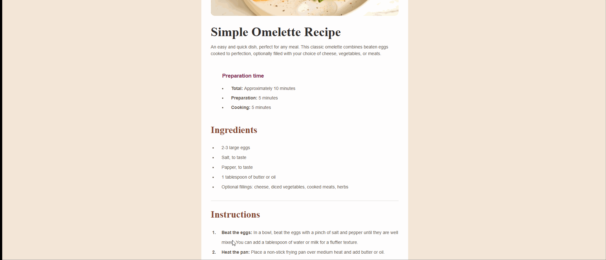

# 🍳 Simple Omelette Recipe

This is a solution to the [Simple Omelette Recipe](https://www.frontendmentor.io) challenge on Frontend Mentor. It is a basic static page built with HTML and CSS, showcasing a recipe card layout.

## 🔗 Live Demo

👉 View site on GitHub Pages(https://anastasiiiii.github.io/frontend-mentor-challenges/recipe-page/)

## 🎥 Demo GIF

## 🛠️ Built with

- Semantic **HTML5**
- **CSS3** (flexbox)
- **Responsive layout**
- Custom styling without frameworks

## 🙌 Acknowledgements

Design by Frontend Mentor
